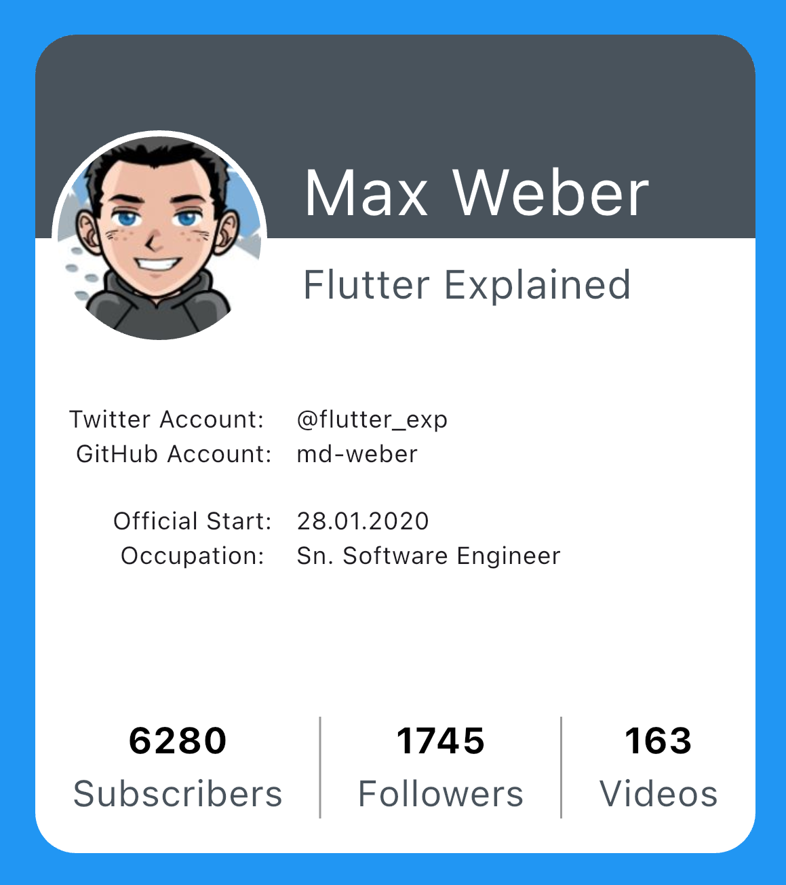

# 🚀 60 Days Flutter Challenge

Welcome to my **60 Days of Flutter Challenge**!  
This repository documents my journey from beginner to advanced Flutter development through building real-world apps.

Each week covers a new project with focused learning goals, and all source code is committed daily.

---

## 🧰 How to Run Any Week's Project

```bash
git clone https://github.com/YOUR_USERNAME/flutter-projects-60day-challenge.git
cd Week\ X/ProjectName
flutter pub get
flutter run
```
---

## 📅 Weekly Roadmap

| Week | Project | Learning Goals | Status |
|------|---------|----------------|--------|
| 🔜 Week 1 | [Profile Card UI](./Week%201/ProfileCardUI) | Dart, widgets, layout, styling | In Progress |
| Week 2 | To-Do App | Text input, ListView, `setState`, Provider | Upcoming |
| Week 3 | Quotes App | Navigation, theme toggle, Provider | Upcoming |
| Week 4 | Login + Firebase Auth | Firebase basics, Provider | Upcoming |
| Week 5–8 | Expense Tracker App | Full App: Auth, Firestore, CRUD, charts, UI | Upcoming |
| Week 9 | Polish & Deploy | Testing, Deployment, GitHub Docs | Upcoming |

---

## 📌 Week 1 – Profile Card UI

**Goal:** Build a simple profile UI and learn the basics of Flutter.

### 🖼️ Output Screenshot
| Profile Card UI |
|-----------------|
|  |

📂 Project Folder: [`Week 1/ProfileCardUI`](./Week%201/ProfileCardUI)  
📖 Detailed Progress: See [Week 1 README](./Week%201/ProfileCardUI/README.md)

---

## 🔄 Daily Code Updates

I commit my code **daily**, even before the final version is ready.  
By the end of the week, each project will be complete, with screenshots and documentation.

---

## 🛠️ Tech Stack

- **Flutter**: UI SDK for building natively compiled apps.
- **Dart**: Language used to write Flutter apps.
- 🔜 Firebase, Provider, Firestore (in later weeks)

---

## 📬 Contact

- GitHub: [@rz-rahimi01](https://github.com/rz-rahimi01)
- Instagram: [@rz_rahimi01](https://instagram.com/rz_rahimi01)

---
## 📄 License

**MIT License © 2025 Rahim Zai Rahimi**

Permission is hereby granted, free of charge, to any person obtaining a copy of this software and associated documentation files (the “Software”), to deal in the Software without restriction, including without limitation the rights  
to use, copy, modify, merge, publish, distribute, sublicense, and/or sell copies of the Software, and to permit persons to whom the Software is furnished to do so, subject to the following conditions:

The above copyright notice and this permission notice shall be included in all copies or substantial portions of the Software.

> **THE SOFTWARE IS PROVIDED "AS IS", WITHOUT WARRANTY OF ANY KIND, EXPRESS OR IMPLIED,**  
> INCLUDING BUT NOT LIMITED TO THE WARRANTIES OF MERCHANTABILITY, FITNESS FOR A PARTICULAR PURPOSE AND NONINFRINGEMENT.  
> IN NO EVENT SHALL THE AUTHORS OR COPYRIGHT HOLDERS BE LIABLE FOR ANY CLAIM, DAMAGES OR OTHER LIABILITY,  
> WHETHER IN AN ACTION OF CONTRACT, TORT OR OTHERWISE, ARISING FROM, OUT OF OR IN CONNECTION WITH THE SOFTWARE  
> OR THE USE OR OTHER DEALINGS IN THE SOFTWARE.
